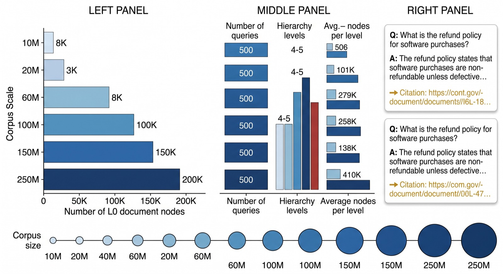
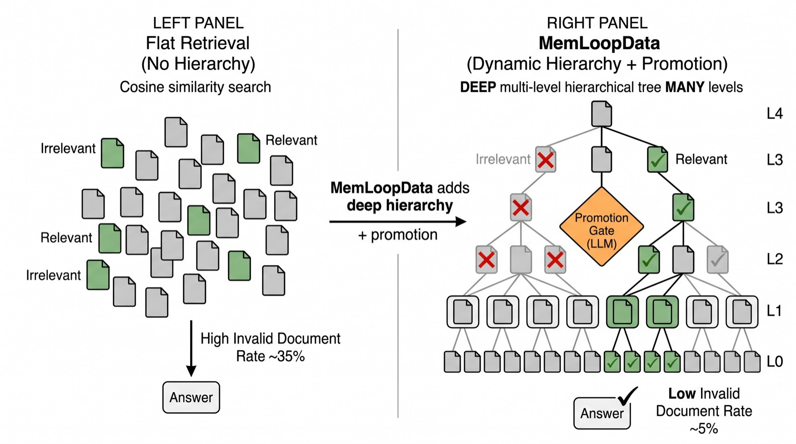
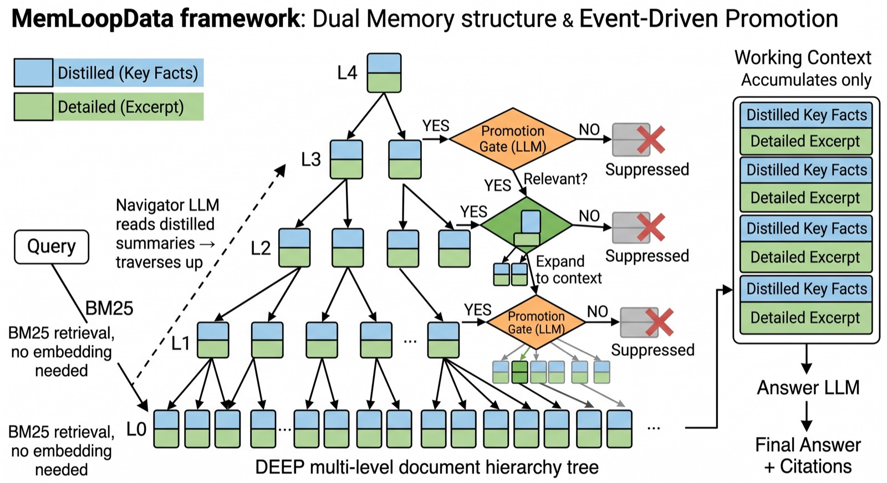
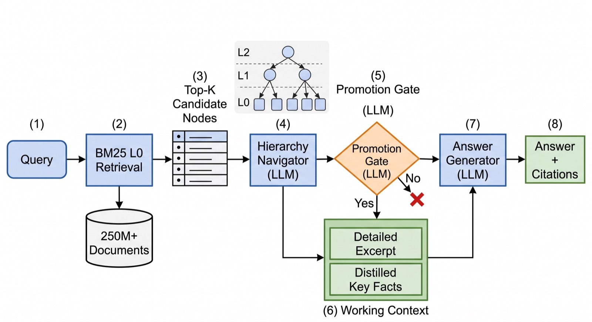

# MemLoop

**Hierarchical memory retrieval with event-driven evidence promotion.**

<p align="center">
  <a href="LICENSE"></a>
  <a href="pyproject.toml"></a>
  <a href="pyproject.toml"></a>
</p>

MemLoop is a Python package and CLI for retrieval systems that need to work over
long-running enterprise context. It organizes raw evidence into a hierarchy,
keeps both compact and detailed memory views, and promotes source evidence only
when a query needs more grounding.

Flat retrieval is useful when the corpus is small. MemLoop is built for the
messier case: large document pools, repeated queries, limited context budgets,
and answers that need citations back to source records.

## What MemLoop Provides

- **Dual memory nodes.** Each node stores `distilled_text` for routing and
  `detailed_text` for grounded answering.
- **Hierarchy construction.** Build L0 evidence nodes into L1/L2+ summaries
  with parent-child provenance.
- **BM25-first retrieval.** Start with a cheap lexical candidate set, then use
  hierarchy navigation and optional dense reranking.
- **Event-driven promotion.** Pull detailed evidence into the answer context
  only for promising nodes.
- **Run accounting.** Track token use, model calls, promoted context, state
  transitions, and answer outputs.
- **Product CLI.** Install once, then run `memloop build-hierarchy`,
  `memloop run`, and `memloop evaluate`.

## Architecture

<p align="center">
  
</p>

MemLoop expects an L0 evidence table, query table, and optional gold labels.
Large manifests stay outside Git; the package reads local parquet and JSONL
files at runtime.

<p align="center">
  
</p>

Queries move through the hierarchy before detailed evidence is loaded. This
keeps the answer context smaller and reduces irrelevant source text.

<p align="center">
  
</p>

The promotion gate controls when a lightweight node becomes a detailed evidence
source. Decay returns stale promoted nodes to the lightweight state.

<p align="center">
  
</p>

The default runner starts with BM25 over L0 nodes, navigates the hierarchy, then
generates citation-aware answers from promoted evidence.

## Install

```bash
git clone git@github.com:Hik289/memloop.git
cd memloop

python -m venv .venv
source .venv/bin/activate
pip install -e ".[all]"
```

For a lighter environment:

```bash
pip install -e .
pip install -e ".[local]"      # local sentence-transformer embeddings
pip install -e ".[llm,eval]"   # provider clients and evaluation tools
```

Check the installation:

```bash
memloop doctor
```

## Configure

Create a local environment file:

```bash
cp .env.example .env
```

Common settings:

| Variable | Purpose |
| --- | --- |
| `MEMLOOP_REPO_ROOT` | Project directory used for `.env`, manifests, results, and caches. |
| `MEMLOOP_ENV_FILE` | Optional explicit path to an environment file. |
| `AZURE_OPENAI_ENDPOINT` | Azure endpoint for OpenAI-compatible deployments. |
| `AZURE_LLM_API_KEY` or `AZURE_OPENAI_KEY` | Key for Azure-backed LLM calls. |
| `AWS_BEDROCK_API_KEY` | Optional key for Bedrock-compatible response calls. |
| `MEMLOOP_EMBED_BACKEND` | `minilm` for local embeddings, or an API-backed backend configured in code. |
| `MEMLOOP_L0_RETRIEVAL` | `bm25` by default; dense reranking can be enabled separately. |
| `MEMLOOP_SKIP_L0_EMBED` | Set to `1` to avoid embedding every L0 node. |
| `MEMLOOP_INDEX_CACHE_DIR` | Optional cache directory for retrieval indexes. |

Runtime secrets belong in `.env` or your process environment. Do not commit real
keys, generated outputs, parquet manifests, JSONL answers, logs, or caches.

## Data Contract

MemLoop does not ship a private enterprise corpus. It expects local files with
these fields:

| File | Format | Required fields |
| --- | --- | --- |
| L0 evidence | parquet | `doc_id`, `source_type`, `title`, `content`, `text` |
| Queries | parquet | `query_id`, `query_text` |
| Gold labels | JSONL | `query_id` or `question_id`, `expected_doc_ids`, `gold_answer` |

Suggested local layout:

```text
manifests/
  l0_nodes.parquet
  queries.parquet
  gold.jsonl
results/
  hierarchy/
  runs/
```

## CLI Workflow

Build a hierarchy:

```bash
memloop build-hierarchy \
  --tier demo \
  --l0_parquet manifests/l0_nodes.parquet \
  --out_dir results/hierarchy/demo \
  --dry_run
```

Run retrieval and answer generation:

```bash
export MEMLOOP_EMBED_BACKEND=minilm
export MEMLOOP_L0_RETRIEVAL=bm25
export MEMLOOP_SKIP_L0_EMBED=1
export MEMLOOP_ANSWER_MODE=detailed_truncated

memloop run \
  --method V5 \
  --hierarchy results/hierarchy/demo/hierarchy.json \
  --queries manifests/queries.parquet \
  --out results/runs/demo/V5 \
  --n_smoke 25 \
  --resume
```

Evaluate answers:

```bash
memloop evaluate \
  --answers results/runs/demo/V5/answers.jsonl \
  --gold manifests/gold.jsonl \
  --out results/runs/demo/V5/eval \
  --resume
```

Run retrieval-only evaluation:

```bash
memloop eval-retrieval \
  results/runs/demo/V5 \
  --gold manifests/gold.jsonl
```

The legacy shell launchers are still available in `scripts/` for batch runs.

## Python API

```python
from memloop.methods.dual_node import DualNode, read_nodes_jsonl
from memloop.methods.promotion_controller import PromotionController
from memloop.methods.decay_controller import DecayController
from memloop.methods.token_ledger import TokenLedger

nodes = {node.node_id: node for node in read_nodes_jsonl("results/hierarchy/demo/hierarchy.json")}
ledger = TokenLedger(run_id="demo", method="V5")
promotion = PromotionController(nodes, embedder=None, promotion_budget=20)
decay = DecayController(nodes, decay_window=15)
```

The high-level runner remains CLI-first because production deployments usually
provide their own storage, scheduler, model gateway, and observability layer.
The lower-level classes are stable enough for integration tests and custom
pipelines.

## Package Layout

```text
memloop/
  core/       # provider adapter, environment loading, config templates
  data/       # hierarchy construction and data preparation
  methods/    # node schema, indexes, promotion, decay, token ledger
  runners/    # retrieval and answer-generation pipelines
  eval/       # answer, citation, retrieval, and ROUGE evaluation
scripts/      # batch launchers built on the package entry points
docs/         # reproduction and operational notes
```

## Development Checks

```bash
python -m compileall -q memloop
memloop doctor
python -m build
```

Before pushing public changes, scan for secrets and local-only paths:

```bash
rg -n --hidden -S "(sk-[A-Za-z0-9]|AKIA[0-9A-Z]{16}|BEGIN (RSA|OPENSSH|PRIVATE)|Bearer [A-Za-z0-9._+/=-]{20,})" .
rg -n "LOCAL_PATH|PRIVATE_PATH|REPLACE_ME" .
```

## Citation

```bibtex
@software{memloop2026,
  title  = {MemLoop: Hierarchical Memory Retrieval with Event-Driven Evidence Promotion},
  author = {MemLoop Authors},
  year   = {2026},
  url    = {https://github.com/Hik289/memloop}
}
```

## License

MIT. See [LICENSE](LICENSE).
