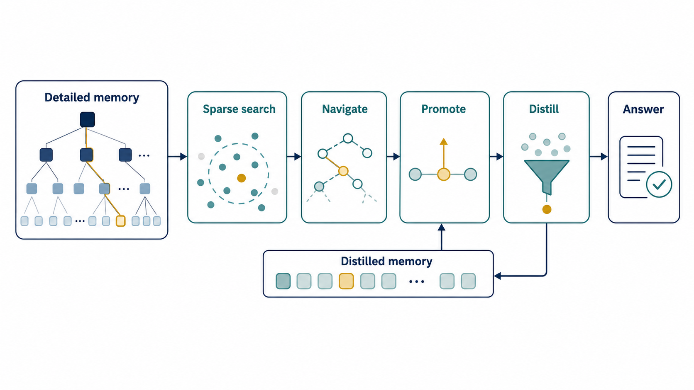
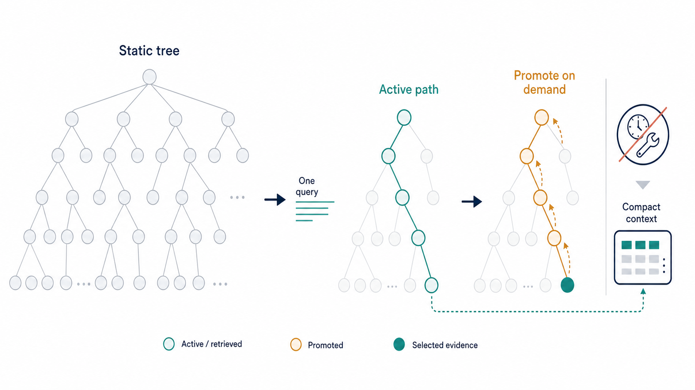
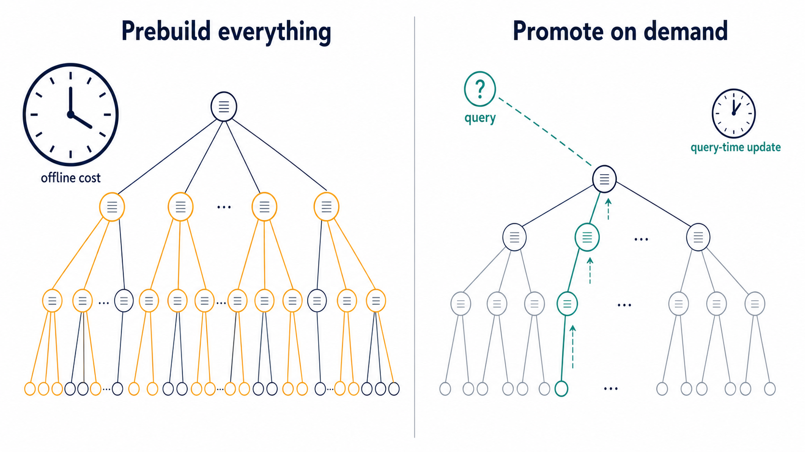
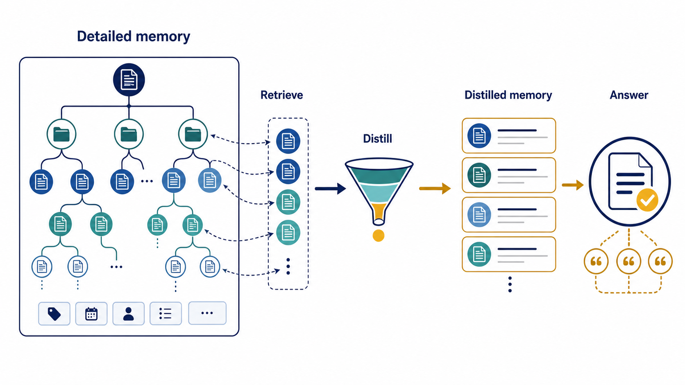

# MemLoop

**Production-ready hierarchical memory retrieval for enterprise RAG.**

<p align="center">
  <a href="LICENSE"></a>
  <a href="pyproject.toml"></a>
  <a href=".github/workflows/ci.yml"></a>
  <a href="pyproject.toml"></a>
</p>

MemLoop turns a large document pool into a query-aware memory system. It builds
a hierarchy over raw evidence, keeps compact memory for routing and detailed
memory for grounding, then promotes source evidence only when a query needs it.

It is built for product teams that need retrieval over long-running enterprise
context: documents, tables, slides, emails, code snippets, tickets, and other
records that do not fit into a single prompt.

<p align="center">
  
</p>

**Pipeline.** MemLoop starts with sparse retrieval, navigates the hierarchy,
promotes useful evidence, distills compact context, and produces a cited answer.
The detailed store remains available, but the answer model only reads the
evidence selected for the current query.

## Why MemLoop

| Problem | MemLoop behavior |
| --- | --- |
| Flat retrieval floods the answer model with noisy context. | Route through a hierarchy and carry forward only a narrow active path. |
| Prebuilding every detailed summary is slow and expensive. | Promote detailed evidence on demand at query time. |
| Summaries are useful for search but not enough for final answers. | Keep both `distilled_text` and `detailed_text` for every node. |
| Product deployments need observability. | Record token use, model aliases, state changes, promoted context, and answer files. |

## Install

```bash
git clone git@github.com:Hik289/memloop.git
cd memloop

python -m venv .venv
source .venv/bin/activate
pip install -e ".[all]"
```

For a lean install:

```bash
pip install -e .              # core CLI and retrieval dependencies
pip install -e ".[local]"     # local sentence-transformer embeddings
pip install -e ".[llm,eval]"  # model providers and evaluation tools
```

Check the environment:

```bash
memloop doctor
```

## Quick Start

Create a tiny local dataset:

```bash
python examples/create_demo_dataset.py
```

Build a hierarchy:

```bash
memloop build-hierarchy \
  --tier demo \
  --l0_parquet examples/demo/manifests/l0_nodes.parquet \
  --out_dir examples/demo/results/hierarchy \
  --dry_run
```

Run a smoke retrieval job:

```bash
export MEMLOOP_EMBED_BACKEND=minilm
export MEMLOOP_L0_RETRIEVAL=bm25
export MEMLOOP_SKIP_L0_EMBED=1
export MEMLOOP_ANSWER_MODE=detailed_truncated

memloop run \
  --method V5 \
  --hierarchy examples/demo/results/hierarchy/hierarchy.json \
  --queries examples/demo/manifests/queries.parquet \
  --out examples/demo/results/runs/V5 \
  --n_smoke 5 \
  --resume
```

Evaluate generated answers when a gold file is available:

```bash
memloop evaluate \
  --answers examples/demo/results/runs/V5/answers.jsonl \
  --gold examples/demo/manifests/gold.jsonl \
  --out examples/demo/results/runs/V5/eval \
  --resume
```

## Core Concepts

<p align="center">
  
</p>

**Query-specific paths.** A query does not expand the full tree. MemLoop first
retrieves a broad candidate set, lets the query choose which branch to inspect,
and carries forward only the evidence needed by the answer.

<p align="center">
  
</p>

**On-demand promotion.** The system avoids a full offline promotion build.
Detailed evidence is promoted after the query identifies useful parent-level
visibility, keeping the promoted set small enough for a context budget.

<p align="center">
  
</p>

**Two memory views.** Detailed memory is large and metadata-rich, optimized for
inspection and grounding. Distilled memory is compact and evidence-focused,
optimized for routing and final answer context.

## Data Contract

MemLoop reads local files. It does not commit private corpora or generated
answer logs.

| File | Format | Required fields |
| --- | --- | --- |
| L0 evidence | parquet | `doc_id`, `source_type`, `title`, `content`, `text` |
| Queries | parquet | `query_id`, `query_text` |
| Gold labels | JSONL | `query_id` or `question_id`, `expected_doc_ids`, `gold_answer` |

Recommended project layout:

```text
manifests/
  l0_nodes.parquet
  queries.parquet
  gold.jsonl
results/
  hierarchy/
  runs/
```

## Configuration

Copy the template and fill in only the providers you use:

```bash
cp .env.example .env
```

| Variable | Purpose |
| --- | --- |
| `MEMLOOP_REPO_ROOT` | Project directory used for `.env`, manifests, results, and caches. |
| `MEMLOOP_ENV_FILE` | Optional explicit path to an environment file. |
| `MEMLOOP_API_BASE_URL` | OpenAI-compatible chat-completions base URL. |
| `MEMLOOP_API_KEY` | API key for the configured model gateway. |
| `MEMLOOP_API_MODEL` | Chat model name or deployment alias. |
| `MEMLOOP_EMBED_BACKEND` | `minilm` for local embeddings, or a configured API-backed backend. |
| `MEMLOOP_EMBED_API_BASE_URL` | Optional OpenAI-compatible embedding endpoint. |
| `MEMLOOP_EMBED_API_KEY` | Optional embedding API key. |
| `MEMLOOP_EMBED_API_MODEL` | Optional embedding model or deployment alias. |
| `MEMLOOP_L0_RETRIEVAL` | `bm25` by default; dense reranking can be enabled separately. |
| `MEMLOOP_SKIP_L0_EMBED` | Set to `1` to avoid embedding every L0 node. |
| `MEMLOOP_INDEX_CACHE_DIR` | Optional cache directory for retrieval indexes. |

Runtime secrets belong in `.env` or your process environment. Do not commit real
keys, parquet manifests, JSONL answers, logs, caches, or generated run outputs.

## CLI Reference

```bash
memloop doctor             # check local package and optional dependencies
memloop build-hierarchy    # build L0-Ln memory hierarchy
memloop run                # run the V5 retrieval and answer pipeline
memloop run-v6             # run the dual-memory V6 wrapper
memloop evaluate           # evaluate answers with citation labels
memloop eval-retrieval     # evaluate retrieval only
memloop eval-rouge         # compute ROUGE metrics locally
memloop api-smoke          # test configured provider calls
```

The shell scripts in `scripts/` are thin batch launchers built on these package
entry points.

## Python API

```python
from memloop.methods import (
    DecayController,
    DualNode,
    PromotionController,
    TokenLedger,
    read_nodes_jsonl,
)

nodes = {
    node.node_id: node
    for node in read_nodes_jsonl("results/hierarchy/demo/hierarchy.json")
}

ledger = TokenLedger(run_id="demo", method="V5")
promotion = PromotionController(nodes, embedder=None, promotion_budget=20)
decay = DecayController(nodes, decay_window=15)
```

Use the CLI for full runs and the Python API for integration tests, custom
storage adapters, dashboards, schedulers, or model gateways.

## Repository Layout

```text
memloop/
  core/       provider adapter, environment loading, config templates
  data/       hierarchy construction and data preparation
  methods/    node schema, indexes, promotion, decay, token ledger
  runners/    retrieval and answer-generation pipelines
  eval/       answer, citation, retrieval, and ROUGE evaluation
assets/      README and documentation figures
docs/        quickstart, configuration, data contract, and operations notes
examples/     demo dataset generator
tests/        package and CLI smoke tests
scripts/      batch launchers
```

## Documentation

- [Quickstart](docs/quickstart.md)
- [Configuration](docs/configuration.md)
- [Data contract](docs/data-contract.md)
- [Operations guide](docs/ARTIFACT.md)

## Development

```bash
pip install -e ".[dev]"
python -m compileall -q memloop
pytest
python -m build
```

Before pushing public changes:

```bash
rg -n --hidden -S "(sk-[A-Za-z0-9]|AKIA[0-9A-Z]{16}|BEGIN (RSA|OPENSSH|PRIVATE)|Bearer [A-Za-z0-9._+/=-]{20,})" .
rg -n "LOCAL_PATH|PRIVATE_PATH|REPLACE_ME" .
```

## Citation

```bibtex
@software{memloop2026,
  title  = {MemLoop: Hierarchical Memory Retrieval with Event-Driven Evidence Promotion},
  author = {MemLoop Authors},
  year   = {2026},
  url    = {https://github.com/Hik289/memloop}
}
```

## License

MIT. See [LICENSE](LICENSE).
